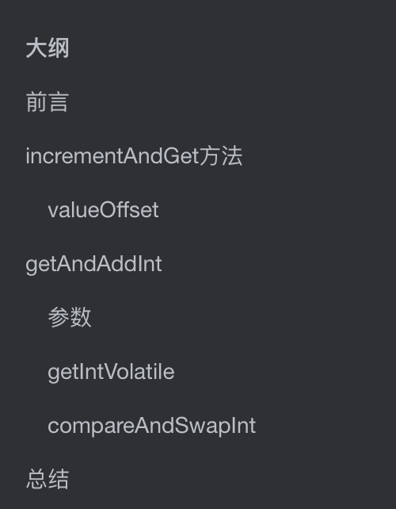
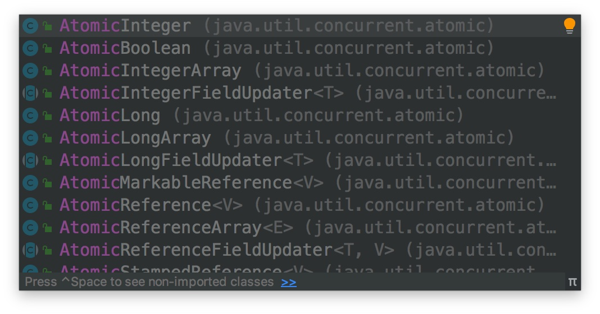
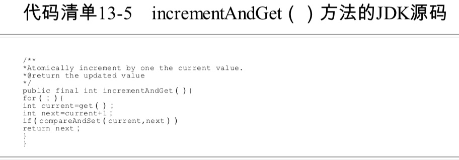

# 大纲



# 前言

我们知道如果是自增，比如`i++`,`i=i+1`这种操作看着只有一步，但是在多线程的情况下，如果没有正确的使用同步，那么他是线程不安全的

那么有没有一个类能够保证这个操作是原子的呢？


有，这个类就是 AtomicInteger。

听着字面意思就知道了，原子操作中的Integer类型，那么既然有Integer类型，是不是也有其他类型呢？答案是肯定的



我们写个下面的这个函数

```java
import java.util.concurrent.atomic.AtomicInteger;

public class VolatileDemo {
    public static AtomicInteger race = new AtomicInteger(0);
    

    public static  void increase() {
        race.incrementAndGet();
    }


    private static final int THREAD_COUNT = 20;

    public static void main(String[] args) {

        Thread[] threads = new Thread[THREAD_COUNT];
        for (int i = 0; i < THREAD_COUNT; i++) {
            threads[i] = new Thread(() -> {
                for (int j = 0;  j< 1000; j++) {
                    increase();
                }
            });

            threads[i].start();
        }

        //等待线程全部执行完
        while (Thread.activeCount() > 1)
            Thread.yield();
        System.out.println(race);

    }
}
```

我们知道这个执行完，输出的是20000，也就是说线程是安全的


那么他是怎么保证的呢？

# incrementAndGet方法

其实他还是使用了CAS操作，来操作数据，我们看下源码


首先，它调用了 AtomicInteger这个类的 `incrementAndGet`方法，这个方法是啥样的呢？

我们跟进这个方法，


我们看到这个方法的注释是这样写的，**自动的给当前值加一**


他的实现是这样的，他又调用了unsafe这个实例的`getAndAddInt`方法，


## valueOffset

重点说一下这个，这个是value属性在内存中的位置，需要强调的是,是value属性在内存中的位置，而不是value值在内存中的位置(前者是具体的数值，后者只是value这个变量本身的地址)


他是用反射的方式来获取这个value属性在地址中的位置


我们再次跟进这个方法

# getAndAddInt


## 参数

这个方法有三个参数，第一个是this，表示当前值，第二个是变量的内存偏移量(可以理解为内存地址)，第三个参数是要加的数，表示每次是将这个数加一，也就是自增，但是他只是这个函数的一个特例而已

其实自增并不是一个单独的函数(在JDK1.8中，在1.7好像是，后面我再给你看下书上的例子)，他只是调用了另一个相加函数，只不过另一个加数永远是1而已

这就跟HashMap中的put方法一样，只存放一个值也只是其中一个个例，只需考虑到就行，并不会给你单独写一个函数


## getIntVolatile

上面的方法又调用了getIntVolatile方法，这个方法是一个本地方法，所以看不到这个方法的实现，但是我们从他的名字上就能推断这个方法的作用（以下都是我的推断，如果你自己想知道，可以google一下）


获取一个被声明为 volatile 变量的 int 值

为什么被声明为 volatile，应该是为了获取内存中最新的数据

## compareAndSwapInt

这也是一个本地方法，我们只能通过推断来判断这个方法的作用


尝试使用CAS操作来设置这个值，如果成功返回true，失败返回false，并且一直进入循环


# JDK1.7

但是在JDK1.7的时候，这个实现就不是这样的



他这个就是单独写的，如果一直没有更新成功就一直循环CAS操作

# 总结

所以CAS是这个AtomicInteger类保证原子的一个重要操作，如果不了解CAS，可以看我的这篇文章，[悲观锁和乐观锁都是啥玩意](https://github.com/leosanqing/Java-Notes/blob/master/ConcurrencyProgramming/0-%E5%9F%BA%E7%A1%80/%E6%82%B2%E8%A7%82%E9%94%81%E5%92%8C%E4%B9%90%E8%A7%82%E9%94%81/%E6%82%B2%E8%A7%82%E9%94%81%E5%92%8C%E4%B9%90%E8%A7%82%E9%94%81.md)