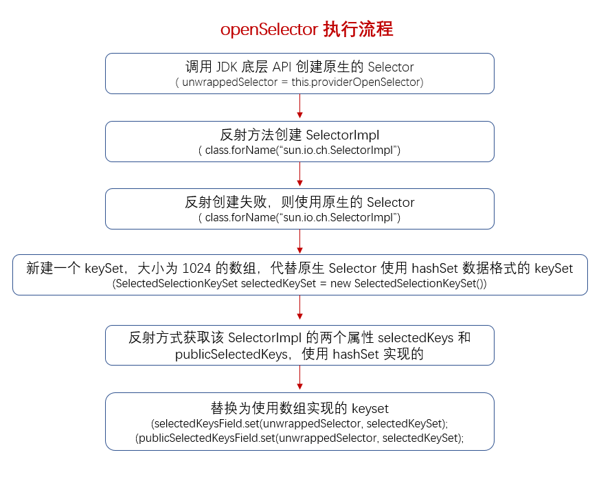

### NioEventLoop 的构造函数
　　**主要是调用底层 JDK 创建 Selector（IO 事件轮询器），一个 Selector 绑定一个线程 NioEventLoop，** 一个 Selector 下有多个 Channel（包装的 Socket）。<br />
　　同时会对原生的 Selector 进行优化，原生的 selectedKeys 和 publicSelectedKeys 都使用 hashSet 实现，Netty 替换为用数组实现，便于使用遍历方式处理，效率更高。

```java
    NioEventLoop(NioEventLoopGroup parent, Executor executor, SelectorProvider selectorProvider,
                 SelectStrategy strategy, RejectedExecutionHandler rejectedExecutionHandler) {
        // 父类构造函数，在 SingleThreadEventLoop 类中会初始化一个任务队列，其值为 DEFAULT_MAX_PENDING_TASKS
        super(parent, executor, false, DEFAULT_MAX_PENDING_TASKS, rejectedExecutionHandler);
        if (selectorProvider == null) {
            throw new NullPointerException("selectorProvider");
        }
        if (strategy == null) {
            throw new NullPointerException("selectStrategy");
        }
        provider = selectorProvider;
        // 创建一个 Selector（IO 事件轮询器），一个 Selector 绑定一个线程 NioEventLoop，
        // 一个 Selector 下有多个 Channel（包装的 Socket），这里会对 keySet 进行优化，从
        // hashset 转换为数组
        final SelectorTuple selectorTuple = openSelector();
        selector = selectorTuple.selector;
        // Selector
        unwrappedSelector = selectorTuple.unwrappedSelector;
        selectStrategy = strategy;
    }
```

### NioEventLoop#openSelector
　　主要是获取优化后的 Selector，原生的 Selector 中 selectedKeys 和 publicSelectedKeys 都使用 hashSet 实现，替换为用数组实现，便于 Netty 使用遍历方式处理，效率更高。



- 调用 JDK 底层 API 创建 Selector；
- 创建一个新线程，使用反射方法获得 SelectorImpl 类对象；
- 使用反射方法获取 SelectorImpl 类的两个属性 selectedKeys 和 publicSelectedKeys，这两个都使用 hashset 来实现的，使用优化后的数组形式的 keySet 代替它们。

```java
    private Selector selector;
    private Selector unwrappedSelector;
    private SelectedSelectionKeySet selectedKeys;
    
    private SelectorTuple openSelector() {
        final Selector unwrappedSelector;
        try {
            // 调用 JDK 底层创建 Selector
            unwrappedSelector = provider.openSelector();
        } catch (IOException e) {
            throw new ChannelException("failed to open a new selector", e);
        }
        // 表示关闭 key 优化，使用原生的 Selector，默认为 false
        if (DISABLE_KEY_SET_OPTIMIZATION) {
            return new SelectorTuple(unwrappedSelector);
        }

        // 创建一个新线程，使用反射方法获得 SelectorImpl 类对象
        Object maybeSelectorImplClass = AccessController.doPrivileged(new PrivilegedAction<Object>() {
            @Override
            public Object run() {
                try {
                    return Class.forName(
                            "sun.nio.ch.SelectorImpl",
                            false,
                            PlatformDependent.getSystemClassLoader());
                } catch (Throwable cause) {
                    return cause;
                }
            }
        });

        // 反射创建失败，则返回原生的 Selector
        if (!(maybeSelectorImplClass instanceof Class) ||
            // ensure the current selector implementation is what we can instrument.
            !((Class<?>) maybeSelectorImplClass).isAssignableFrom(unwrappedSelector.getClass())) {
            if (maybeSelectorImplClass instanceof Throwable) {
                Throwable t = (Throwable) maybeSelectorImplClass;
                logger.trace("failed to instrument a special java.util.Set into: {}", unwrappedSelector, t);
            }
            return new SelectorTuple(unwrappedSelector);
        }

        final Class<?> selectorImplClass = (Class<?>) maybeSelectorImplClass;
        // 新建一个 keySet，大小为 1024 的数组，代替原先使用 hashset 数据格式的 keySet
        final SelectedSelectionKeySet selectedKeySet = new SelectedSelectionKeySet();

        Object maybeException = AccessController.doPrivileged(new PrivilegedAction<Object>() {
            @Override
            public Object run() {
                try {
                    // 使用反射方式获取该 selectorImplClass 的两个属性 selectedKeys 和 publicSelectedKeys，
                    // 这两个属性都用 hashset 实现的
                    Field selectedKeysField = selectorImplClass.getDeclaredField("selectedKeys");
                    Field publicSelectedKeysField = selectorImplClass.getDeclaredField("publicSelectedKeys");

                    // 如果 Java 版本为 9 及以上，则尝试用 Unsafe 来代替 SelectionKeySet
                    if (PlatformDependent.javaVersion() >= 9 && PlatformDependent.hasUnsafe()) {
                        long selectedKeysFieldOffset = PlatformDependent.objectFieldOffset(selectedKeysField);
                        long publicSelectedKeysFieldOffset =
                                PlatformDependent.objectFieldOffset(publicSelectedKeysField);

                        if (selectedKeysFieldOffset != -1 && publicSelectedKeysFieldOffset != -1) {
                            PlatformDependent.putObject(
                                    unwrappedSelector, selectedKeysFieldOffset, selectedKeySet);
                            PlatformDependent.putObject(
                                    unwrappedSelector, publicSelectedKeysFieldOffset, selectedKeySet);
                            return null;
                        }
                    }

                    Throwable cause = ReflectionUtil.trySetAccessible(selectedKeysField, true);
                    if (cause != null) {
                        return cause;
                    }
                    cause = ReflectionUtil.trySetAccessible(publicSelectedKeysField, true);
                    if (cause != null) {
                        return cause;
                    }

                    // 这两个属性 selectedKeysField 和 publicSelectedKeysField 的 keySet 从原生的 hashset 格式
                    // 替换为数组格式的 selectedKeySet
                    selectedKeysField.set(unwrappedSelector, selectedKeySet);
                    publicSelectedKeysField.set(unwrappedSelector, selectedKeySet);
                    return null;
                } catch (NoSuchFieldException e) {
                    return e;
                } catch (IllegalAccessException e) {
                    return e;
                }
            }
        });

        if (maybeException instanceof Exception) {
            selectedKeys = null;
            Exception e = (Exception) maybeException;
            logger.trace("failed to instrument a special java.util.Set into: {}", unwrappedSelector, e);
            return new SelectorTuple(unwrappedSelector);
        }
        // 数组形式的 keySet，在 processSelectedKeys 用到
        selectedKeys = selectedKeySet;
        logger.trace("instrumented a special java.util.Set into: {}", unwrappedSelector);
        return new SelectorTuple(unwrappedSelector,
                                 new SelectedSelectionKeySetSelector(unwrappedSelector, selectedKeySet));
    }
```

#### SelectedSelectionKeySet 的构造函数
　　数组形式的 keySet，在 NioEventLoop#openSelector 中有使用，代替原生的 hahset 的 keySet。

```java
    SelectedSelectionKeySet() {
        keys = new SelectionKey[1024];
    }
```
