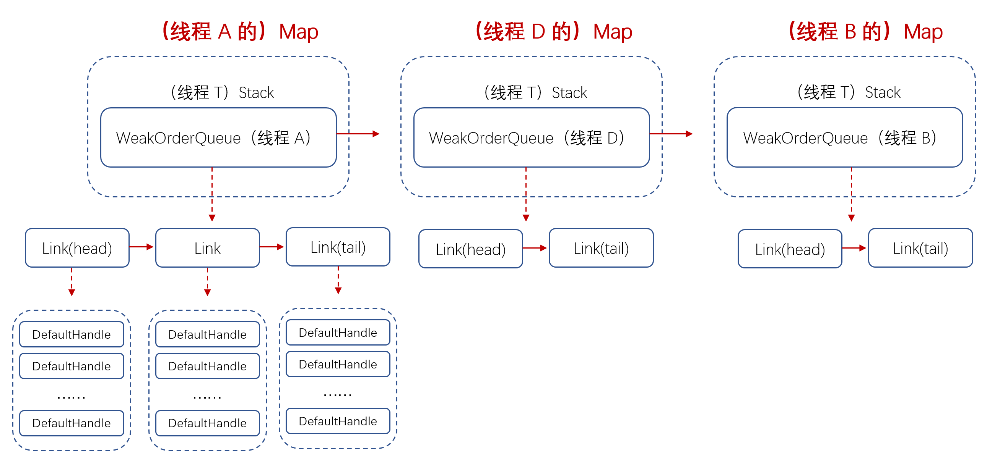

### Recycler
　　Recycler 为 Netty 的轻量级对象池，用于获取对象和用完回收对象，其优势：

- **可复用对象，** 省去了频繁创建、销毁对象的开销；
- **减少 young GC，** 因为减少了不必要的对象创建，因此 JVM 年轻代垃圾减少。

### [get](https://github.com/martin-1992/Netty-Notes/blob/master/Recycler/get.md)
　　从对象池中获取对象，获取不到对象时会调用 [scavenge](https://github.com/martin-1992/Netty-Notes/blob/master/Recycler/scavenge.md) 方法从当前线程 Stack 对应的 WeakOrderQueue 链表回收 DefaultHandle 对象。

### [recycle](https://github.com/martin-1992/Netty-Notes/blob/master/Recycler/recycle.md)
　　回收对象有两种：

- 同线程回收对象，即对象在一个线程中分配，同时在该线程中回收对象；
- 异线程回收对象，即对象在一个线程中分配，但在另一个线程中回收对象。

#### 异步回收对象使用的结构
　　如下图，假设在线程 A 中回收线程 T 创建的对象。

- 获取 WeakOrderQueue；
	1. 从线程 A 的 Map<Stack<?>, WearOrderQueue> 根据线程 T 的 Stack（要回收的对象 handle 绑定了线程 T 的 Stack），获取线程 A 创建的 WeakOrderQueue；
	2. 如果是线程 B，则创建线程 B 的 WearOrderQueue。每个线程都会创建 WearOrderQueue，将要回收对象的 Stack 和创建的 WearOrderQueue，将要回收对象的绑定，添加到 Map 中；
	3. 创建的 WearOrderQueue 会插入到 WearOrderQueue 链表的头节点。比如 （线程 A 创建的）WearOrderQueue ->（线程 D 创建的）WearOrderQueue -> （线程 B 创建的）WearOrderQueue；
	4. 在 WearOrderQueue 链表中，当有一个线程销毁，则会删除该线程的 WearOrderQueue，在删除前，会先回收该 WearOrderQueue 的对象。
- WeakOrderQueue 默认会创建两个 Link，头节点 head 和 tail，单向链表。
	1. Link 底层为 DefaultHandle 数组，大小为 16；
	2. 当一个 Link 添加满了对象 handle 后，就创建下个 Link，继续添加，所以使用单向链表即可；
	3. 回收对象时，是回收一个 Link 中的对象。如果该 Link 没有，则删除该 Link，回收下个 Link。
- DefaultHandle 对象，包含的属性 Stack、value、recycleId、lastRecycledId、hasBeenRecycled。
	1. Stack，对象池（对象为 DefaultHandle），使用数组实现的栈；
	2. value，用户自定义创建的对象，即真正要获取的对象，是绑定到 DefaultHandle 的。根据 DefaultHandle 来获取对象；
	3. recycleId、lastRecycledId，防止多次调用回收方法 recycle；
	4. hasBeenRecycled 用于控制回收频率，当该对象没有回收过时（hasBeenRecycled=false），则每隔 8 个回收该对象，即只回收八分之一的对象。
